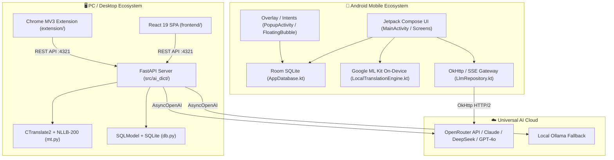

# AI Dict: Cross-Platform Monorepo Specification & Parity Architecture

This document is the **definitive cross-platform architectural specification** for the unified AI Dict monorepo. It details the relationship, functional parity, platform divergence, and synchronization rules between:
1. **Desktop / PC Ecosystem:** FastAPI Backend (`src/ai_dict`), React 19 SPA (`frontend/`), and Chrome Extension (`extension/`).
2. **Mobile Ecosystem:** Native Android Application (`android/`) built with Jetpack Compose, Room SQLite, OkHttp/SSE, and Google ML Kit.

---

## 1. Unified Monorepo Directory Structure

The repository is organized as a unified multi-client codebase sharing design contracts, system prompts, default settings, and feature concepts:

```
AI_Dict/
├── src/ai_dict/               # PC FastAPI Backend & Local Services
│   ├── server.py              # REST API controller & SPA static asset server
│   ├── ai.py                  # OpenRouter / Ollama LLM gateway, reasoning budgets & lenses
│   ├── mt.py                  # Offline Machine Translation (CTranslate2 + NLLB-200 int8)
│   ├── db.py                  # SQLModel / SQLAlchemy database schema & engine
│   ├── config.py              # Configuration & platformdirs paths
│   └── static/                # Pre-compiled static assets from frontend build
│
├── frontend/                  # PC Desktop Web UI (React 19 SPA)
│   ├── src/
│   │   ├── App.jsx            # Main app controller, navigation tabs, global state
│   │   ├── components/        # Mode tabs (Search, Compare, Explain, Translate, MT, Correct, QuickLlm)
│   │   └── index.css          # TailwindCSS 4 styles & themes
│   ├── package.json           # React / Vite / Tailwind dependencies
│   └── vite.config.js         # Build configuration targeting src/ai_dict/static/
│
├── extension/                 # Chrome Browser Extension (Manifest V3)
│   ├── manifest.json          # MV3 configuration, background service worker, permissions
│   ├── content.js             # Shadow DOM floating bubble & card, video subtitle piercing
│   ├── content.css            # Scoped Shadow DOM styles (YouTube/Netflix shielded)
│   ├── popup.html / popup.js  # Toolbar extension menu & quick lookups
│   └── options.html           # Extension configuration page
│
├── android/                   # Native Android Mobile Application
│   ├── app/
│   │   ├── build.gradle.kts   # Android build configuration (compileSdk 34, JVM 17)
│   │   └── src/main/java/com/aidict/app/
│   │       ├── MainActivity.kt           # Full Compose UI entry point
│   │       ├── PopupActivity.kt          # System PROCESS_TEXT floating card
│   │       ├── TranslateActivity.kt      # System TRANSLATE intent receiver
│   │       ├── FloatingBubbleService.kt  # WindowManager overlay service
│   │       ├── data/
│   │       │   ├── AppDatabase.kt        # Room database with SQLite persistence
│   │       │   ├── entities/             # Word, ChatMessage, Profile, Session entities
│   │       │   ├── dao/AppDao.kt         # SQL queries with reactive Kotlin Flow
│   │       │   ├── LlmRepository.kt      # OpenRouter API client with streaming & fallback
│   │       │   └── LocalTranslationEngine.kt # Google ML Kit on-device translation
│   │       ├── ui/
│   │       │   ├── screens/              # Search, Compare, Explain, Translate, Correct, Settings
│   │       │   ├── viewmodels/           # SearchViewModel, SettingsViewModel, AppViewModel
│   │       │   └── components/           # Markdown text, shared UI, model pickers
│   │       └── utils/
│   │           ├── DefaultPrompts.kt     # System prompts, lenses & analytical presets
│   │           └── LanguageManager.kt    # Starred, custom flags & language codes
│   ├── build_and_push.sh      # Automated release builder, version bumper & git pusher
│   └── release_latest.apk     # Standalone distribution APK
│
├── .github/workflows/
│   └── auto_release.yml       # GitHub Actions workflow: releases APK upon commit
├── CROSS_PLATFORM_SPEC.md     # This comprehensive architectural specification
├── DESIGN.md                  # Core design philosophy and cognitive rationale
├── TECHNICAL_SPECS.md         # PC Backend API contracts & SQLite schemas
└── AGENTS.md                  # Autonomous agent operating instructions
```

---

## 2. Feature Parity & Matrix Comparison

Both PC and Android implement the same pedagogical philosophy: **Production Over Recognition**, **Zero-Memory Default Offline Lookup**, and **One-Click AI Escalation**.

| Feature / Capability | PC Web UI | PC Chrome Extension | Android Mobile App | Parity Status |
|---|---|---|---|---|
| **Dictionary Search (`dict`)** | ✅ Multi-tab, lemma, IPA, collocations, production drills | ✅ Card / Bubble lookup with follow-up | ✅ Dedicated tab with auto-suggestions & history | 100% Identical Prompt & Workflow |
| **Word Comparison (`compare`)** | ✅ Side-by-side nuance analysis | ✅ Toolbar popup comparison | ✅ Dedicated screen & cross-mode handoff | 100% Identical Prompt |
| **Text Explanation (`explain`)** | ✅ Full sentence breakdown & ellipsis pattern analysis | ✅ Card / Bubble text analysis | ✅ Dedicated screen & ellipsis pattern analysis | 100% Identical Prompt |
| **Reverse Concept (`translate`)** | ✅ Expression exploration & nuance comparison | ✅ Toolbar popup concept lookup | ✅ Dedicated screen with source/target selection | 100% Identical Prompt |
| **Text Correction (`correct`)** | ✅ Correction-Only vs Correction + Translation | ✅ Card / Bubble correction | ✅ Dedicated screen & MT tier selector | 100% Identical Prompt & Flow |
| **Quick LLM / Lenses** | ✅ 6 Lenses (Quick Glance, Grammar, Nuance, ELI5, TL;DR, Dialogues) + custom lenses | ✅ Floating lens selector, instant prompt switching | ✅ Analytical presets in `DefaultPrompts.kt` & settings scoping | 100% Compatible Presets |
| **Offline Machine Translation** | ✅ Meta NLLB-200 (600M int8 via CTranslate2 CPU) | ✅ Sub-second card lookup (zero-memory default) | ✅ Google ML Kit on-device translation (~30MB/pack) | Intentional Architectural Divergence |
| **Follow-Up Contextual Chat** | ✅ Infinite conversational turn retention per item | ✅ Interactive follow-up input in Shadow DOM card | ✅ Interactive follow-up input per Word item | 100% Identical Workflow |
| **System-Wide Overlay** | ❌ (Confined to browser) | ✅ Shadow DOM card on all web pages & video subtitles | ✅ `SYSTEM_ALERT_WINDOW` Floating Bubble & `PROCESS_TEXT` | Platform-Native Implementation |
| **Profiles & Scope** | ✅ Scoped SQLite tables per `profile_id` | ✅ Profile selector in popup menu | ✅ Scoped Room entities & profile inheritance | 100% Functional Parity |
| **Custom Language Flags** | ✅ Starred languages & custom flag codes | ✅ Starred languages & popup flags | ✅ Custom language adding (`Name\|Flag`) & ordering | 100% Functional Parity |
| **Color Tags & Star Ratings** | ✅ 5 colors & 1–5 stars for filtering | ❌ (Ephemeral view) | ✅ 5 colors & 1–5 stars with Room reactive sync | Functional Parity |
| **Flashcard Review** | ✅ 1-col/2-col decks, 3D flip animation, keyboard shortcuts | ❌ (Dedicated to webapp) | ✅ Notes & saved words review screen | Complementary Design |
| **Data Backup / Restore** | ✅ JSON/ZIP database export & import | ❌ (Managed via backend) | ✅ Full JSON backup export & import (`BackupHelper`) | 100% JSON Schema Compatible |

---

## 3. Platform Divergences: Technical Rationale (Why Keep As Such)

The PC and Android versions differ in four primary architectural areas. These differences are **intentional engineering trade-offs** optimized for desktop workstations versus resource-constrained mobile hardware. **Do not attempt to homogenize these implementations.**

```
┌────────────────────────────────────────────────────────────────────────┐
│                   Divergence 1: Offline MT Engine                      │
├───────────────────────────────────┬────────────────────────────────────┤
│ PC Desktop: CTranslate2 + NLLB    │ Android: Google ML Kit             │
│ - Meta NLLB-200 600M distilled    │ - Google ML Kit On-Device          │
│ - Model size: ~1.2 GB (int8)      │ - Pack size: ~30 MB per language   │
│ - Hardware: x86_64 AVX2 / CPU     │ - Hardware: Android NNAPI / GPU    │
│ - Languages: 200+ native Flores   │ - Languages: 59 core languages     │
│ - High RAM ceiling (>16GB typical)│ - Low RAM ceiling (<4GB typical)   │
└───────────────────────────────────┴────────────────────────────────────┘
```

### 3.1 Offline MT Engine: CTranslate2 (PC) vs. Google ML Kit (Android)

#### PC Desktop Implementation
- **Technology:** CTranslate2 int8 inference engine executing Meta's NLLB-200 (600M distilled parameter model) on CPU.
- **Why it fits PC:** Modern desktop and laptop CPUs have large L3 caches, AVX2/AVX-512 SIMD instruction sets, and 16GB+ of RAM. Downloading a ~1.2GB model once to `~/.local/share/ai_dict/` is trivial on a PC with hundreds of gigabytes of NVMe storage. NLLB-200 offers translation quality across 200+ languages, including low-resource languages and dialect variations.
- **Why unfeasible on Mobile:** Loading a 1.2GB CTranslate2 model into an Android process would immediately trigger the Android OS Low Memory Killer (OOM killer), especially when running concurrently with video streaming or browser apps. It would also lead to battery drain and thermal throttling.

#### Android Mobile Implementation
- **Technology:** Google ML Kit On-Device Translation API (`com.google.mlkit:translate:17.0.3`).
- **Why it fits Mobile:**
  1. Each language model pack is only **~30 MB**, downloaded on-demand (e.g. English, German, Vietnamese) rather than downloading a monolithic 1.2GB model.
  2. Inference is accelerated via the Android Neural Networks API (NNAPI) and mobile GPU/NPU, executing translations in **under 80 milliseconds** with minimal battery impact.
  3. The app provides a dedicated `ManageOfflineModelsDialog.kt` allowing users to inspect, download, or delete language packs over Wi-Fi.
- **Contract Parity:** Both implementations satisfy the identical user contract:
  - **100% offline and private.**
  - **Zero-cost, zero-latency translation.**
  - **Zero-memory history by default** (prevents flooding history with fleeting selections).
  - **One-click "✨ Resume with AI LLM" handoff** to deepen any machine translation into a full pedagogical explanation.

---

```
┌────────────────────────────────────────────────────────────────────────┐
│                   Divergence 2: Database Architecture                  │
├───────────────────────────────────┬────────────────────────────────────┤
│ PC Desktop: Segregated SQLModel   │ Android: Polymorphic Room Entity   │
│ - Separate tables: Word, Compare, │ - Single table: Word(mode = ...)   │
│   Explain, Translation, Correction│ - Cascading ChatMessage(wordId)    │
│ - Multi-tab desktop browsing      │ - Reactive Kotlin Flow<List<Word>> │
│ - Independent chat histories      │ - 1-tap mode conversion & morph    │
└───────────────────────────────────┴────────────────────────────────────┘
```

### 3.2 Database Schema: Segregated Tables (PC) vs. Polymorphic Entity (Android)

#### PC Desktop Implementation
- **Schema:** Discrete SQLModel tables in SQLite:
  - `Word` (Dictionary lookups)
  - `Comparison` (Side-by-side terms)
  - `Explain` (Sentences/grammar)
  - `Translation` (Reverse concept lookups)
  - `Correction` (Proofreading & polish)
  - `LlmRecord` & `MtRecord` (Card lookups)
- **Why it fits PC:** The desktop Web UI uses a multi-tab interface (`searchTabs`, `compareTabs`, `mtTabs`, `explainTabs`). Users keep 10+ tabs open simultaneously across multiple windows. Segregating tables allows specialized indexes, independent query optimization, and structured relational queries without cross-mode lock contention.

#### Android Mobile Implementation
- **Schema:** A unified, polymorphic Room table:
  ```kotlin
  @Entity(tableName = "words")
  data class Word(
      @PrimaryKey(autoGenerate = true) val id: Int = 0,
      val profileId: Int,
      val term: String,
      val mode: String, // "dict" | "compare" | "translate" | "explain" | "correct"
      val language: String? = null,
      val lemma: String? = null,
      val stars: Int = 0,
      val color: String? = null,
      val sessionId: String? = null,
      ...
  )
  ```
  linked to a single `@Entity(tableName = "chat_messages")` table with `ForeignKey.CASCADE`.
- **Why it fits Mobile:**
  1. **Smooth HorizontalPager navigation:** Mobile screens use a unified swipeable pager (`AppNavigation.kt`). Having a polymorphic `Word` table allows a single `Flow<List<Word>>` to drive suggestions, unified history searches, and quick filters.
  2. **1-Tap Mode Conversion:** Android allows the user to switch an item between modes instantly:
     ```kotlin
     fun moveWordToModeAndRegenerate(word: Word, targetMode: String)
     ```
     With a polymorphic table, this is a single column update (`UPDATE words SET mode = :targetMode WHERE id = :id`), followed by re-triggering the LLM stream. In a segregated schema, this would require cross-table deletes, inserts, and ID re-mapping.

---

```
┌────────────────────────────────────────────────────────────────────────┐
│             Divergence 3: Contextual Capture & Overlays                │
├───────────────────────────────────┬────────────────────────────────────┤
│ PC Desktop: Chrome MV3 Extension  │ Android: WindowManager & Intents   │
│ - Isolated Shadow DOM container   │ - System WindowManager Overlay     │
│ - Subtitle DOM piercing (YouTube) │ - FloatingBubbleService (24/7)     │
│ - Video event shielding           │ - PROCESS_TEXT & TRANSLATE Intents │
└───────────────────────────────────┴────────────────────────────────────┘
```

### 3.3 Contextual Capture: Shadow DOM (PC) vs. WindowManager & Intents (Android)

#### PC Desktop Implementation
- **Mechanism:** Chrome Manifest V3 Extension (`extension/`).
- **Challenges addressed:** Web pages (YouTube, Netflix, Coursera, GitHub) have hostile CSS, complex shadow DOMs, and global keyboard shortcuts.
  - The extension mounts inside an isolated `#ai-dict-extension-root` Shadow DOM to guarantee style isolation.
  - It uses recursive tree crawling (`getDeepSelection`) to penetrate video player shadow roots.
  - It intercepts and stops keyboard propagation (`e.stopPropagation()`) so typing `f` or `k` does not toggle YouTube fullscreen or pause playback.
  - It listens for `fullscreenchange` and re-parents the popup into `document.fullscreenElement`.

#### Android Mobile Implementation
- **Mechanism:** Android System OS Services and Activity Intent Filters:
  1. **`FloatingBubbleService`:** Uses `WindowManager.LayoutParams.TYPE_APPLICATION_OVERLAY` to float a round draggable bubble over all third-party apps (e.g. YouTube, Kindle, Twitter, Chrome).
  2. **`PopupActivity`:** Registers for `android.intent.action.PROCESS_TEXT` and `android.intent.action.SEND`. When the user selects text anywhere in Android and taps the system text selection menu, AI Dict appears in a floating modal bottom-sheet.
  3. **`TranslateActivity`:** Registers for `android.intent.action.TRANSLATE`, allowing AI Dict to act as the primary system translation provider.
- **Why it fits Mobile:** Mobile web browsers running on Android do not support desktop Chrome Extensions; native system intents and window manager overlays are the standard Android platform mechanism for system-wide text interception.

---

```
┌────────────────────────────────────────────────────────────────────────┐
│               Divergence 4: Background Execution Engine                │
├───────────────────────────────────┬────────────────────────────────────┤
│ PC Desktop: CLI Daemon / Systemd  │ Android: Foreground Service & Lock │
│ - Uvicorn server on localhost     │ - BackgroundSyncService (Sticky)   │
│ - Unthrottled process lifetime    │ - PARTIAL_WAKE_LOCK protection     │
│ - Direct asyncio event loop       │ - Battery optimization bypass      │
└───────────────────────────────────┴────────────────────────────────────┘
```

### 3.4 Background Execution: Server Daemon (PC) vs. Foreground Service (Android)

#### PC Desktop Implementation
- The backend is a standard Python process managed by Uvicorn. The OS does not freeze sockets or terminate background processes unless explicitly stopped by the user.

#### Android Mobile Implementation
- Modern Android versions (Android 12–14+) aggressively kill background processes and suspend network sockets after seconds of screen inactivity.
- Android uses `BackgroundSyncService`:
  - Registers as a foreground service with `FOREGROUND_SERVICE_TYPE_DATA_SYNC`.
  - Holds an active `PARTIAL_WAKE_LOCK` during LLM streaming.
  - Maintains a silent sticky notification showing live generation progress (`"Looking up term..."`).
  - Requests battery optimization exemption (`ACTION_IGNORE_BATTERY_OPTIMIZATION_SETTINGS`) so long-running reasoning generations (such as DeepSeek R1 or Claude thinking) are never aborted mid-stream.

---

## 4. Synchronous Cross-Platform Maintenance Protocol

Whenever a contributor or autonomous agent modifies a feature, prompt, or setting, they **must update both platform implementations** to maintain full compatibility. Follow this checklist:

### Protocol 1: System Prompts & Lenses
If you modify or add a system prompt (e.g. in `src/ai_dict/ai.py` or `system_prompt.txt`):
1. **Update PC:**
   - Modify the prompt string and regex extractors in `src/ai_dict/ai.py`.
   - Update `SIMPLE_LLM_PROMPTS` if changing lenses.
2. **Update Android:**
   - Update `android/app/src/main/java/com/aidict/app/utils/DefaultPrompts.kt` (`DICT_PROMPT`, `COMPARE_PROMPT`, `EXPLAIN_PROMPT`, `TRANSLATE_PROMPT`, `CORRECT_PROMPT`, or `QUICK_LLM_PRESETS`).
   - If regex extraction markers change, update `MarkdownParser.kt`.

### Protocol 2: AI Settings & Models
If you introduce a new model setting (e.g., a reasoning level, fallback model, or lens model):
1. **Update PC:**
   - Add the key getter in `src/ai_dict/ai.py`.
   - Add frontend controls in `frontend/src/components/SettingsTab.jsx`.
   - Build frontend: `cd frontend && npm run build`.
2. **Update Android:**
   - Add the setting key to `SettingsViewModel.kt` (`ProfileAiConfig`, `resolveItem`, `copyAiSettings`).
   - Add Compose controls to `SettingsScreen.kt`.
   - Update `LlmRepository.kt` to pass the parameter in `ChatRequest`.

### Protocol 3: Data Schema & Entities
If you add an attribute to words or messages:
1. **Update PC:**
   - Add field to `src/ai_dict/db.py`.
   - Run raw SQLite `ALTER TABLE` script against the live database (see Rule 3.1 in `AGENTS.md`).
2. **Update Android:**
   - Add field to `android/app/src/main/java/com/aidict/app/data/entities/Entities.kt`.
   - If changing Room schema, bump database version in `AppDatabase.kt` and provide a migration or `fallbackToDestructiveMigration()`.
   - Update `BackupHelper.kt` to ensure export/import JSON serializes the new field.

### Protocol 4: Releasing & Verification
1. **Verify PC:**
   - `python3 -m py_compile src/ai_dict/*.py`
   - `cd frontend && npm run build`
   - `node -c extension/*.js`
2. **Verify Android:**
   - `cd android && ./gradlew compileDebugKotlin`
   - Run `./build_and_push.sh` or `./gradlew assembleDebug` to produce a fresh `release_latest.apk`.

---

## 5. Summary: Monorepo Architecture Blueprint



By maintaining this structured monorepo, AI Dict provides an end-to-end language learning ecosystem that operates with near-complete conceptual parity on desktop workstations, within web browsers, and on mobile devices.
