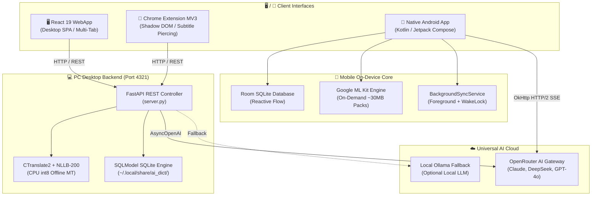

# AI Dict

AI Dict is an **AI-powered dictionary, language learning, and translation workbench** engineered for deep, contextual, and durable language study. It bridges state-of-the-art Large Language Models (LLMs) and high-speed local offline Machine Translation (NLLB-200) into a unified, local-first application — giving you an interactive language tutor, dictionary, and flashcard review system that grows with your personal learning journey.

Unlike traditional static dictionaries, AI Dict operates on a **dual-track architecture**:
1. **Instant Offline Machine Translation:** Powered by Meta's NLLB-200 running locally on your CPU via CTranslate2 — sub-second, zero-cost, completely offline translation across 200+ languages.
2. **Deep LLM Inquiry:** Powered by leading AI models (Claude 3.5/3.7, DeepSeek R1/V3, GPT-4o, or local Ollama) — exhaustive etymology, cultural register, grammar breakdowns, and multi-turn follow-up conversations.

All data is stored locally in your private SQLite database. Zero telemetry. Zero accounts. Zero cloud lock-in.

---

## ✨ Feature Matrix

| Mode / Feature | Description | Engine / Model |
|---|---|---|
| **Intelligent Word Search** | Deep, contextual word explanations: etymology, connotations, collocations, CEFR levels, and example sentences. | OpenRouter LLM / Ollama |
| **Word Comparison** | Compare 2+ words side-by-side to understand nuanced differences in tone, formality, and usage constraints. | OpenRouter LLM / Ollama |
| **Text Explanation** | Paste complex sentences or literary excerpts for full grammatical breakdowns, idioms, and syntax parsing. | OpenRouter LLM / Ollama |
| **Conceptual Translation** | Nuanced, culturally accurate translations explaining tone, idioms, and contextual alternatives. | OpenRouter LLM / Ollama |
| **Offline Machine Translation** | Instant dual-box MT (Google Translate style). Fast, free, runs on CPU, fully offline. Editable translations with auto-save. | CTranslate2 + NLLB-200 (int8) |
| **Quick LLM (Ling Flash)** | Instant, focused linguistic lookup through interchangeable analytical lenses (Grammar, Nuance, ELI5, TL;DR, Dialogues, Socratic). | OpenRouter LLM / Ollama |
| **Spaced Repetition Flashcards** | Review vocabulary decks with active recall. 1-col/2-col layouts, instant vs. 3D flip animations, fullscreen mode, keyboard controls. | Native React UI + SQLite |
| **Text Correction & Polish** | Proofread and edit text with detailed grammatical explanations, style suggestions, and translation comparisons. | OpenRouter LLM / Ollama |
| **Browser Extension (MV3)** | Definer replacement. Instant text selection bubble, double-click lookup, YouTube/Netflix subtitle piercing, and 1-click MT/LLM toggling. | Manifest V3 (Shadow DOM) |
| **Follow-up Chat** | Ask the AI follow-up questions directly inside any search, comparison, or explanation result with full context retention. | OpenRouter / Ollama Streaming |
| **Profiles & Study Sessions** | Separate learning contexts (e.g., "German C1", "Medical Spanish"). Temporal session grouping (`YYYY-MM-DD` or named units). | Scoped SQLite Tables |
| **Color Tags & Star Ratings** | Color bookmarks (Red, Orange, Yellow, Green, Blue) and 1–5 star ratings for vocabulary curation and flashcard filtering. | SQLite Metadata |
| **Dynamic Hover Preview** | Hover over any history item in the sidebar to view its full Markdown explanation in a resizable floating popup. | Fixed Viewport Clamped UI |
| **External Dictionary Links** | Dynamic link buttons to Cambridge, LEO, Duden, Wiktionary, etc., populated automatically with detected language and lemma. | Configurable URL Templates |
| **1-Click Backup & Restore** | Export and import your entire SQLite database and configuration as a timestamped `.zip` archive. | Native ZIP Streaming |

---

## 🏛️ Architecture Overview



- **PC Backend:** Python 3.10+ (tested on 3.11+), FastAPI, SQLModel, Uvicorn, CTranslate2, Tokenizers, SentencePiece.
- **PC Frontend:** React 19, Vite 8, TailwindCSS 4, Lucide React, react-markdown, mermaid, KaTeX.
- **PC Extension:** Chrome Manifest V3, Shadow DOM style encapsulation, deep subtitle traversal.
- **Android App:** Kotlin 1.9+, Jetpack Compose, Room SQLite, Google ML Kit (Translate & Language ID), OkHttp SSE, compileSdk 34.

---

## ⚖️ WebApp vs. Phone App: Comparison & Parity

AI Dict is engineered as a unified cross-platform system. Both desktop and mobile editions share the same pedagogical foundation: **Production Over Recognition**, **Zero-Memory Default Offline Translation**, and **Interchangeable Analytical Lenses**.

However, because desktop workstations and mobile phones have different memory envelopes, compute architectures, and operating system permissions, each client is custom-tailored for its form factor:

### Feature Parity Matrix

| Feature / Capability | 🖥️ PC WebApp | 🧩 Chrome Extension | 📱 Android Phone App | Architectural Rationale & Parity |
|---|---|---|---|---|
| **Intelligent Dictionary (`dict`)** | ✅ Multi-tab, IPA, etymology, CEFR, collocations | ✅ Floating card / selection bubble | ✅ Dedicated tab with auto-suggestions & history | **100% Identical Prompt & Workflow** |
| **Word Comparison (`compare`)** | ✅ Multi-word side-by-side nuance analysis | ✅ Toolbar popup quick comparison | ✅ Dedicated screen with cross-mode handoff | **100% Identical Prompt** |
| **Sentence Breakdown (`explain`)** | ✅ Clause parsing & ellipsis patterns | ✅ Quick selection breakdown | ✅ Dedicated screen & ellipsis analysis | **100% Identical Prompt** |
| **Concept Translation (`translate`)**| ✅ Idiomatic & cultural reverse exploration | ✅ Quick concept lookup | ✅ Dedicated screen with source/target selection | **100% Identical Prompt** |
| **Text Correction (`correct`)** | ✅ Proofread with grammar & translation options | ✅ Quick card text polish | ✅ Dedicated screen & MT tier selector | **100% Identical Prompt & Flow** |
| **Quick LLM / Lenses (Ling Flash)** | ✅ 6 built-in lenses + custom lens manager & reorder | ✅ Instant lens selector & prompt switching | ✅ Analytical presets (`DefaultPrompts.kt`) | **100% Compatible Presets & Contracts** |
| **Follow-Up Contextual Chat** | ✅ Multi-turn conversation retention per item | ✅ Interactive follow-up input in card | ✅ Interactive follow-up input per Word item | **100% Identical Conversation Continuity** |
| **Profiles & Scoping** | ✅ Scoped SQLite tables per `profile_id` | ✅ Profile switcher in toolbar menu | ✅ Scoped Room entities & profile inheritance | **100% Functional Parity** |
| **Offline Machine Translation** | ✅ Meta NLLB-200 (600M distilled via CTranslate2 CPU) | ✅ Sub-second card lookup (zero-memory default) | ✅ Google ML Kit On-Device (~30MB/pack via NNAPI) | **Optimized per Hardware:** NLLB-200 requires ~1.2GB RAM (ideal for PC); ML Kit uses ~30MB packs with zero battery drain on mobile. |
| **Database Architecture** | ✅ Segregated SQLModel tables (`Word`, `Comparison`, etc.) | ❌ Connects via REST API | ✅ Polymorphic Room table (`Word(mode=...)`) | **Optimized per UX:** Segregated tables suit multi-tab desktop multitasking; unified table enables smooth swipe navigation and 1-tap mode morphing on mobile. |
| **Contextual Text Capture** | ❌ Confined to browser | ✅ Isolated Shadow DOM with subtitle piercing | ✅ System Floating Bubble & `PROCESS_TEXT` menu | **Platform-Native:** Browser extension pierces YouTube/Netflix DOM; Android overlay floats over all native apps (Kindle, Twitter, YouTube). |
| **Background Streaming Protection** | ✅ Standard persistent local daemon (FastAPI / Uvicorn) | ❌ Extension service worker | ✅ `BackgroundSyncService` + `PARTIAL_WAKE_LOCK` | **OS Resilience:** Prevents Android OS Low Memory Killer (OOM) from aborting long-running LLM reasoning streams (e.g. DeepSeek R1). |
| **Vocabulary Review & Deck** | ✅ Spaced repetition flashcards (1-col/2-col, 3D flip) | ❌ Ephemeral reading view | ✅ Notes & saved words review screen | **Complementary:** WebApp specializes in deep active-recall drills; mobile provides on-the-go review. |
| **Data Backup & Portability** | ✅ JSON & timestamped ZIP archive export/import | ❌ Managed via WebApp backend | ✅ Full JSON backup export/import (`BackupHelper`) | **100% JSON Schema Compatible** across PC and mobile. |

### Technical Divergences (Why Keep As Such)

1. **Offline MT: CTranslate2 + NLLB-200 (PC) vs. Google ML Kit (Android)**
   - **PC Desktop:** Modern desktop CPUs have large L3 caches, AVX2 SIMD instruction sets, and 16GB+ RAM. Meta NLLB-200 (600M distilled) provides state-of-the-art offline translation across 200+ languages without network overhead.
   - **Android Mobile:** Loading a 1.2GB model into mobile RAM triggers Android's Low Memory Killer (OOM) and causes thermal throttling. Google ML Kit downloads lightweight ~30MB packs on-demand and leverages mobile NPUs/GPUs (NNAPI) for sub-80ms translations with minimal battery impact.

2. **Database: Segregated SQLModel Tables (PC) vs. Polymorphic Room Entity (Android)**
   - **PC Desktop:** Web users frequently keep 10+ tabs open across multiple browser windows. Discrete tables (`Word`, `Comparison`, `Explain`, `Translation`, `Correction`, `LlmRecord`, `MtRecord`) prevent lock contention and enable specialized indexing.
   - **Android Mobile:** Mobile navigation uses a fluid `HorizontalPager`. A single polymorphic `Word` table allows reactive Kotlin `Flow<List<Word>>` to power cross-mode suggestions, unified history searches, and **1-tap mode morphing** (`moveWordToModeAndRegenerate`) without complex table migrations.

3. **Context Capture: Shadow DOM (PC) vs. System Overlay & Intents (Android)**
   - **PC Desktop:** Web applications require Shadow DOM isolation, recursive tree crawling (`getDeepSelection`) to penetrate video players, and event shielding (`stopPropagation`) to prevent keyboard shortcut capture on video platforms.
   - **Android Mobile:** Mobile browsers do not support desktop extensions. Android uses `FloatingBubbleService` (`SYSTEM_ALERT_WINDOW`) and `PROCESS_TEXT` intents to provide system-wide text lookups across any app (Kindle, Chrome, Twitter).

---

## 🚀 Installation & Setup

### Prerequisites
- Python 3.10 or higher (Python 3.11+ recommended)
- Node.js 18+ (tested on Node 20+)
- `uv` (recommended) or `pip`

### Step 1: Clone the Repository
```bash
git clone https://github.com/yourusername/ai_dict.git
cd ai_dict
```

### Step 2: Install Python Backend Dependencies
Using `uv` (recommended):
```bash
uv pip install -e .
```
Or standard `pip`:
```bash
pip install -e .
```

### Step 3: Build the Frontend Static Assets
```bash
cd frontend
npm install
npm run build
cd ..
```
*Note: The FastAPI backend serves the pre-compiled assets from `src/ai_dict/static/`.*

### Step 4: Launch AI Dict
```bash
ai_dict
```
Open your browser and navigate to:
```
http://127.0.0.1:4321
```

---

## 🧩 Installing the Chrome Extension

AI Dict includes a powerful companion Chrome Extension that brings instant lookups and subtitle translation to any webpage, YouTube video, or HTML5 player:

1. Open Chrome / Brave / Edge and navigate to `chrome://extensions/`.
2. Toggle on **Developer mode** in the top-right corner.
3. Click **Load unpacked** and select the `extension/` directory inside this repository.
4. Pin the **AI Dict** icon to your browser toolbar.
5. Highlight any text on any page or video to trigger the floating lookup bubble!

> For full extension documentation, keyboard shortcuts, and video configuration, see [extension/README.md](file:///run/host/home/dkchw/Documents/Code/Ongoing/Repo/AI_Dict/extension/README.md).

---

## 📱 Native Android Mobile App

AI Dict includes a full-featured native Android app (`android/`) designed with Jetpack Compose, Room SQLite, and Google ML Kit on-device translation:

### Features on Android:
- **System-wide Floating Bubble:** Draggable overlay that floats above all apps (YouTube, Kindle, Twitter, Chrome).
- **Text Selection Integration (`PROCESS_TEXT`):** Select text anywhere on Android to trigger instant AI explanations without switching apps.
- **System Translation Provider:** Handles standard Android `TRANSLATE` intents.
- **24/7 Background Protection:** `BackgroundSyncService` maintains long-running LLM streaming and reasoning with a persistent foreground service and wake lock.
- **Offline ML Kit Engine:** Fast on-device offline translation using lightweight (~30MB) language packs.

### Building & Installing the APK:
1. **Pre-built APK:** Download or install `android/release_latest.apk`.
2. **Build from source:**
   ```bash
   cd android
   ./gradlew assembleRelease
   ```
3. **Automated Release Script:**
   ```bash
   cd android
   ./build_and_push.sh "Release title / notes"
   ```
   *(Bumps version code, builds signed release APK, updates `release_latest.apk`, and pushes to GitHub triggering the `.github/workflows/auto_release.yml` pipeline).*

---

## ⚙️ Initial Configuration

On your first launch, click the **Settings** gear icon (⚙️) in the sidebar:

1. **OpenRouter API Key:** Enter your OpenRouter API key (get one at [openrouter.ai](https://openrouter.ai)).
2. **Model Selection:** Select your preferred primary LLM (e.g., `deepseek/deepseek-v4-flash-0731` or `anthropic/claude-3.5-sonnet`).
3. **Reasoning Effort:** Configure thinking budgets per mode (`none`, `low`, `medium`, `high`, `max`).
4. **Offline MT Engine:** The NLLB-200 600M model (~600MB) will automatically download on your first MT lookup on PC. On Android, language packs download on-demand.
5. **Local Ollama Fallback (Optional):** Enable Ollama fallback if you want local LLM capability when offline on PC.

---

## 📚 Documentation Index

For comprehensive documentation, consult the dedicated guides:

- [CROSS_PLATFORM_SPEC.md](file:///run/host/home/dkchw/Documents/Code/Ongoing/Repo/AI_Dict/CROSS_PLATFORM_SPEC.md) — Definitive cross-platform monorepo architecture, feature matrix, technical mismatch justifications, and sync protocols.
- [DESIGN.md](file:///run/host/home/dkchw/Documents/Code/Ongoing/Repo/AI_Dict/DESIGN.md) — Architectural philosophy, design principles, dual-track MT/LLM strategy, security considerations, and trade-offs.
- [TECHNICAL_SPECS.md](file:///run/host/home/dkchw/Documents/Code/Ongoing/Repo/AI_Dict/TECHNICAL_SPECS.md) — Complete technical specification, SQLite database schema, REST API catalog, CTranslate2 threading details, and frontend state machine.
- [AGENTS.md](file:///run/host/home/dkchw/Documents/Code/Ongoing/Repo/AI_Dict/AGENTS.md) — Operational guidelines for AI coding agents and human contributors, build contracts, database migration protocols, and common pitfalls.
- [android/README.md](file:///run/host/home/dkchw/Documents/Code/Ongoing/Repo/AI_Dict/android/README.md) — Native Android application architecture, Jetpack Compose, Room SQLite, ML Kit offline MT, and build workflows.
- [extension/README.md](file:///run/host/home/dkchw/Documents/Code/Ongoing/Repo/AI_Dict/extension/README.md) — Browser extension architecture, YouTube/Netflix subtitle piercing, event shielding, and usage guide.

---

## 📄 License

Licensed under the Apache License 2.0. See [LICENSE](LICENSE) for details.
